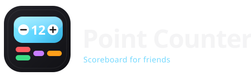

# Point Counter

<p align="center">
  
</p>

A lightweight web scoreboard for friends — inspired by the [Point Counter](https://apps.apple.com/app/point-counter) iOS app, rebuilt as a personal web app so our group can track game scores quickly on any phone or laptop.

Made by **Sora**.

## Why this exists

We needed a simple shared-feeling counter for board games, cards, and casual nights out. This project reimplements the core Point Counter experience on the web:

- Fast ± scoring with big touch targets
- Multiple groups / games
- Score history with undo
- Drag-to-reorder players
- Dark UI that works well on mobile

No accounts, no backend — everything stays in the browser (`localStorage`).

## Features

- **Players** — add, edit, delete, custom color & step (±1, ±5, ±10, …)
- **Groups** — separate scoreboards (e.g. UNO, Pool, Cafe)
- **History** — consecutive ± changes are grouped; expand for details; undo one step or a whole chain
- **Sort** — manual (drag), high → low, low → high
- **Persistence** — state saved locally across reloads

## Stack

- React 19 + TypeScript + Vite
- Tailwind CSS v4 + shadcn/ui
- `@dnd-kit` for drag-and-drop
- Prettier for formatting

## Getting started

```bash
npm install
npm run dev
```

Open the URL shown in the terminal (usually `http://localhost:5173`).

### Scripts

| Command                | Description                  |
| ---------------------- | ---------------------------- |
| `npm run dev`          | Start dev server             |
| `npm run build`        | Typecheck + production build |
| `npm run preview`      | Preview production build     |
| `npm run lint`         | Run Oxlint                   |
| `npm run format`       | Format with Prettier         |
| `npm run format:check` | Check formatting             |

## Project layout

```
src/
  App.tsx                 # Shell, dialogs, dnd
  components/             # UI (cards, dialogs, history)
  hooks/use-scoreboard.ts # React state hook
  lib/
    scoreboard.ts         # Pure scoreboard logic
    history.ts            # History cluster / restore
    storage.ts            # localStorage load/save
    format.ts             # Display helpers
  types.ts
public/
  favicon.svg
  logo.svg
```

## License

Private project for personal / friend-group use.
